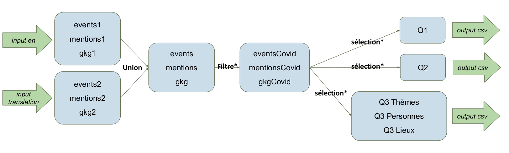
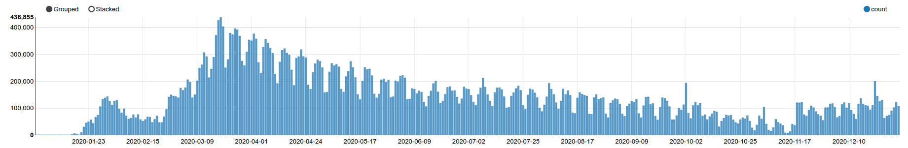

# GDELTProject

Authors: Fabrice Pont, Morgan Fassier, Adrien Robiliard, Théo Lefièvre, Ernest Majdalani

## Project Scope

Design a resilient distributed database to store worldwide events related to COVID-19 that were mentioned in all media sources in the year 2020 from the GDELT Database.

In this project we aim to answer the following :

+ How many articles and events are related to the COVID-19 pandemic, grouped by day, country and language ?
+ For a given country, list all events that have taken place sorted by how many times they were mentioned, grouped by _yyyy, yyyy-mm or yyyy-mm-dd_.
+ For a given source (gkg.SourceCommonName), list the average tone and number of articles associated with each theme, person and location, grouped by _yyyy, yyyy-mm or yyyy-mm-dd_.
+ Do we observe a pattern that could identify another pandemic / pandemic wave ?

## Technologies Used

+ Cassandra 3.11.9
+ Spark 3.0.1
+ Zeppelin 0.9.0
+ AWS S3
+ AWS EMR: 1 master node, 5 workers (m5.xlarge)

## Architecture

## Setting up the environment
### Deployment of resources on AWS
+ #### Terraform
+ #### Ansible

## Data Preparation
### Cassandra Tables

+ __Replication Strategy:__ SimpleStrategy
+ __Replication Factor:__ 3

The following tables have been designed with the idea that their content will be used within Spark for computations such as counts, averages and aggregations etc...

Otherwise, to see how the tables would be designed and queried within cqlsh, you can take a look at the [presentation](presentation.pdf) (slides 6, 7, 8).

__Table 1__:

    CREATE TABLE q1 (
        event_id int, 
        mention_date date, 
        mention_id text, 
        language text, 
        country_code text, 
        PRIMARY KEY(mention_date, country_code, language, mention_id))

__Table 2__:

    CREATE TABLE q2 (
        event_id int, 
        mention_id text, 
        event_date date, 
        country_code text, 
        PRIMARY KEY((event_date, country_code), mention_id))

__Table 3__:

    CREATE TABLE q3themes (
        gkg_record_id text, 
        publication_date date, 
        source_name text, 
        themes text, 
        tone double, 
        PRIMARY KEY((publication_date), gkg_record_id)) 
        WITH CLUSTERING ORDER BY (gkg_record_id ASC)

    CREATE TABLE q3persons (
        gkg_record_id text, 
        publication_date date, 
        source_name text, 
        persons text, 
        tone double, 
        PRIMARY KEY((publication_date), gkg_record_id)) 
        WITH CLUSTERING ORDER BY (gkg_record_id ASC)

    CREATE TABLE q3locations (
        gkg_record_id text, 
        publication_date date, 
        source_name text, 
        location text, 
        tone double, 
        PRIMARY KEY((publication_date), gkg_record_id)) 
        WITH CLUSTERING ORDER BY (gkg_record_id ASC)

### ETLs for data preparation

We have two files as inputs :
+ [masterfile.txt](http://data.gdeltproject.org/gdeltv2/masterfilelist.txt) for articles in english
+ [masterfile-translation.txt](http://data.gdeltproject.org/gdeltv2/masterfilelist-translation.txt) for articles in other languages

Those input files contain urls that allow us to download all news media data from GDELT that we upload to an S3 bucket (see [spark code uploading data to S3](notebooks/uploadDataToS3.zpln)). With those files we create 6 dataframes :
+ 3 for the english ones : events, mentions and gkg
+ 3 for those in another language

We then set the union between english and translation dataframes, leaving us with 3 respectively concatenated dataframes (events, mentions and gkg).

Given the project scope, we then filtered articles relating only to the COVID-19 pandemic (we can find the entire list of themes [here](documentation/themes.txt)).

Finally, we selected the features for each question Q1, Q2, Q3Themes, Q3Personnes and Q3Lieux (see [spark code processing data to S3](notebooks/processedDataToS3.zpln) to have a more detailed explanation of which features we take and how we do it). After setting up the required dataframes, they are converted to csv files and uploaded to an S3 bucket for reuse. It is important to note that we worked on AWS Educate accounts and therefore dealt with many constraints, most notably relating to budget.

### Writing to the Cassandra Cluster

See: [Notebook S3toCassandra](notebooks/S3toCassandra.zpln)

### Queries

See: [Notebook CassandraQueries](notebooks/CassandraQueries.zpln)

#### Charts

*Pie chart showing the distribution of the 1000 most mentioned events for the whole 2020 year*

*Maximum number of articles for an event by month in the US*

### Opening on "Do we observe a pattern that could identify another pandemic / pandemic wave ?"

To see if we could identify a pattern, we take a look a the number of articles per day talking about the COVID-19 and the average tone of those articles per day. See below.

The plots shown above put forth useful information. In fact, during the first few weeks in january / february / march we can identify the following:
+ an increase in the number of articles talking about the COVID-19 / day : from 0 -> 100 000 in the end of january -> 440 000 in march
+ an increase in the average tone / day : from -6 in january to a stabilized value of -2 after march

We can also perhaps predict / prevent another pandemic wave using the 1st plot. Mid-november we clearly see the 2nd pandemic wave due to the COVID-19.
